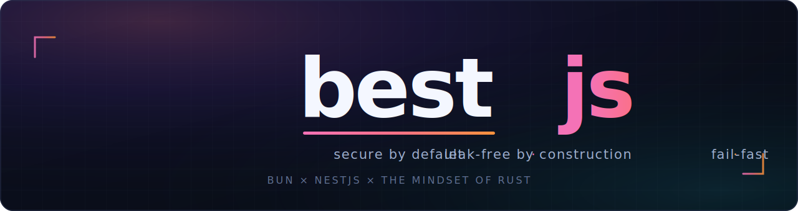
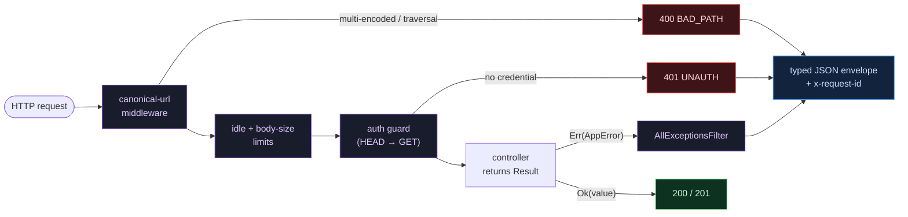

<div align="center">



<br/>

[](https://bun.com)
[](https://nestjs.com)
[](tsconfig.json)
[](test/)
[](#-proof-it-runs)
[](src/core/security/password.service.ts)

**Rust's discipline for a NestJS-on-Bun service.**
Errors as values · RAII ownership · bounded buffers · panic-on-bad-state —
so entire failure classes are <em>unrepresentable</em>, not patched.

</div>

> [!IMPORTANT]
> Built on **Bun 1.3.14** (now an Anthropic project) + **NestJS 11.1.28**.
> Every "critical issue" that motivated this repo was **fact-checked against primary sources** before a single line was hardened **.

---

## ⚡ Quickstart

```bash
mise install            # provisions Bun 1.3.14 (pinned & reproducible)
mise exec -- bun install
cp .env.example .env    # then set a real APP_SECRET (>= 32 chars)

mise run dev            # 🔥 watch mode, hot reload
mise run check          # typecheck + test + audit (the CI gate)
```

<div align="center">

**Try the hardening live** — every bypass is blocked by construction:

</div>

```bash
curl  localhost:3000/health/ready            # 🟢 {"status":"ready",...}
curl  localhost:3000/demo/users/999          # 🟠 404 — typed error envelope
curl  localhost:3000/admin/secret            # 🔴 401 — protected route
curl 'localhost:3000/%61dmin/secret'         # 🔴 401 — encoding bypass BLOCKED
curl 'localhost:3000/%2561dmin/secret'       # 🔴 400 — double-encoding REJECTED
curl -I localhost:3000/admin/secret          # 🔴 401 — HEAD folded to GET
```

---

## 🧱 The five principles

Each borrows one idea from Rust and encodes it so the failure class **can't happen** —
not *"be careful,"* but *"the type / loop / graph won't let you."*

| # | Principle | Rust idea | Kills the failure class |
|:-:|:----------|:----------|:------------------------|
| 1️⃣ | **Fail-fast bootstrap** | panic on bad init, not mid-request | silent DI hang · bad config · zombie process |
| 2️⃣ | **Typed errors** | `Result<T,E>` + exhaustive match | `default: 500` · uncaught guard errors |
| 3️⃣ | **RAII lifecycle** | ownership + guaranteed `Drop` | long-running memory leaks · dangling handles |
| 4️⃣ | **Bounded I/O** | bounded buffers + backpressure | recursive-frame DoS · URL/HEAD auth bypass |
| 5️⃣ | **Reproducible & native-free** | pinned, no fragile FFI | supply-chain drift · native-addon crashes |

<details>
<summary><b>1️⃣ &nbsp;Fail-fast bootstrap</b> — <i>a program that can't reach a valid state refuses to start</i></summary>

<br/>

- 🧷 **Typed config panic** — [env.schema.ts](src/core/config/env.schema.ts) validates the whole environment with zod **at import time**. A missing `APP_SECRET` exits **`78` (EX_CONFIG)** with a precise message — never an `undefined` that becomes a hole under load. Nothing else may read `process.env`.
- 🔍 **Static DI cycle detector** — [dependency-cycle.ts](src/core/bootstrap/dependency-cycle.ts) walks Nest's own metadata, unwraps `forwardRef`, and runs **Tarjan's SCC** to prove the provider graph is acyclic *before* Nest builds it — killing the confirmed silent-hang bug (`nestjs/nest#11630`, verdict **TRUE**).
- ⏱️ **Bootstrap watchdog** — [boot-deadline.ts](src/core/bootstrap/boot-deadline.ts) races `NestFactory.create()` against a hard deadline and hard-exits with the partial construction graph. A hang becomes a diagnosable crash.
- 💥 **Fatal process guards** — [process-guards.ts](src/core/bootstrap/process-guards.ts) turn `unhandledRejection` / `uncaughtException` into immediate `exit(1)`. No zombie serving from corrupt state.

</details>

<details>
<summary><b>2️⃣ &nbsp;Typed errors</b> — <i><code>Result&lt;T,E&gt;</code> and exhaustive matching</i></summary>

<br/>

- 🎯 [result.ts](src/core/result.ts): `Result<T,E>` so the failure branch lives in the **type signature** — you can't touch the value without handling the error.
- 🧩 [app-error.ts](src/core/errors/app-error.ts): one **closed** `AppError` union. Add a kind and the compiler forces every mapper to handle it (no `default: 500`).
- 🚪 [all-exceptions.filter.ts](src/core/errors/all-exceptions.filter.ts): the **single** place errors become HTTP responses. The structural fix for *"guards run before interceptors"* (verdict **TRUE**) — everything just `throw`s and converges here.

</details>

<details>
<summary><b>3️⃣ &nbsp;RAII lifecycle</b> — <i>every resource is owned; cleanup is guaranteed</i></summary>

<br/>

- 🧰 [resource-registry.ts](src/core/lifecycle/resource-registry.ts): the **sole owner** of every non-GC resource. LIFO drain on shutdown, per-resource timeout, and a **leak tripwire** that logs the allocation site of anything not released.
- 🔗 [managed.ts](src/core/lifecycle/managed.ts): the only ergonomic way to make timers/listeners/subscriptions — each registers its own teardown **atomically**, so an un-owned resource can't be produced.
- 🩺 [lifecycle-state.service.ts](src/core/lifecycle/lifecycle-state.service.ts) + [main.ts](src/main.ts): liveness ≠ readiness; SIGTERM flips readiness → drains → `app.close()` under a hard budget. The real defense against the *"long-running memory leak"* class — independent of any Bun GC quirk.

</details>

<details>
<summary><b>4️⃣ &nbsp;Bounded I/O</b> — <i>untrusted input never drives unbounded recursion/allocation</i></summary>

<br/>

- 🧱 [length-prefixed-frame-decoder.ts](src/core/transport/length-prefixed-frame-decoder.ts): a **provably non-recursive**, byte-capped frame decoder — the structural fix for the recursive-`handleData()` DoS (**CVE-2026-40879**, verdict **TRUE**). 50k frames in one chunk parse in a flat loop; an oversized length prefix is rejected *before* allocation. **100% covered.**
- 🪣 [token-bucket.ts](src/core/transport/token-bucket.ts): lazy, timer-free per-connection backpressure.
- 🧭 [canonical-url.middleware.ts](src/core/http/canonical-url.middleware.ts): decode once → reject residual `%` → strip dot-segments → **rewrite `req.url` to the canonical path** so routing *and* guards see one path. Neutralizes the encoding-bypass (**CVE-2025-69211**) and, via `foldMethod`, the HEAD-bypass (**CVE-2026-33011**) classes.
- 🛡️ [path-prefix-auth.guard.ts](src/core/http/path-prefix-auth.guard.ts): authorizes on the **canonical** path in a **guard** (not middleware), so it can't silently no-op or be bypassed.
- 🚧 [request-limits.ts](src/core/http/request-limits.ts): body-byte cap, idle-socket timeout (slowloris), per-handler time budget.

</details>

<details>
<summary><b>5️⃣ &nbsp;Reproducible & native-free</b> — <i>pin everything, avoid fragile FFI</i></summary>

<br/>

- 📌 **Bun pinned** in [mise.toml](mise.toml); exact versions in [package.json](package.json); frozen installs in CI.
- 🔐 **Zero node-gyp native addons.** Hashing uses `Bun.password` (argon2id) — [password.service.ts](src/core/security/password.service.ts) — sidestepping the entire native-addon surface (verdict **MIXED**; only `canvas` is actually broken, but depending on nothing native is the robust choice).
- 📊 **Structured JSON logging** ([logger.config.ts](src/core/observability/logger.config.ts)) + **liveness/readiness** ([health.controller.ts](src/core/observability/health.controller.ts)) + **RSS watermark** ([memory-watermark.service.ts](src/core/observability/memory-watermark.service.ts)).

</details>

---

## 🌀 Request lifecycle

Every request flows through one canonical path — no encoding or method trick can make
routing and authorization disagree, and every outcome exits through a single typed filter.



---

## ⚡ Performance & the `turbo` tier

bestjs ships **two runtimes that share one security core**:

- **`src/main.ts`** — the full **NestJS** app (DI, modules, guards, OpenAPI-ready). Structure first.
- **`src/turbo.ts`** — the *same* guarantees served **directly on `Bun.serve`**, with no Express/DI per-request tax. Elysia-class speed.

Both reuse the **identical** pure primitives (`canonicalizePath`, `foldMethod`, `TokenBucket`, `AppError`), so "fast" never means "less safe" — `turbo` passes the exact same auth-bypass matrix (`/%61dmin` → 401, double-encoding → 400, HEAD → 401).

**Benchmark** — Apple M5 Pro, Bun 1.3.14, single process, hello-JSON, 100 conns × 10s, 0 errors:

| Runtime | req/s | p50 | p99 | |
|:--------|------:|----:|----:|:--|
| raw `Bun.serve` | ~74k | 1ms | 2ms | the ceiling |
| Elysia | ~75k | 1ms | 2ms | Bun-native |
| **bestjs `turbo`** | **~75k** | **1ms** | **2ms** | **= Elysia, full security** |
| bare Express (Bun) | ~61k | 1ms | 3ms | |
| **bestjs NestJS** | **~37k** | **2ms** | **4ms** | the structure tax |

> [!NOTE]
> Everything at ~75k was **client-capped** (the load generator saturated at ~75k on the same box), so raw-bun / Elysia / `turbo` are tied *at least* there. The NestJS 37k is genuinely server-bound — the gap is Express + DI + the middleware chain, **not** Bun and **not** the security checks.

**Scale past one core — `SO_REUSEPORT` clustering (no proxy, no shared state):**

```bash
bun run turbo            # single fast path
bun run turbo:cluster    # N workers, kernel load-balanced (TURBO_WORKERS=cpucount)
```

**What about Rust?** We measured it, we didn't guess. A Rust `cdylib` canonicalizer called via `bun:ffi` beat the TypeScript one by only **1.07×** — FFI marshalling ate the native gain, and canonicalization already runs at **3.8M ops/s** (~0.02% of the request budget). **Rust is the wrong tool for tiny per-request work**; it pays off only for CPU-heavy batch operations where marshalling amortizes. The real win was architectural (drop Express); the real scaling lever is `reusePort`.

**Rule of thumb:** `turbo` for latency-critical hot paths · NestJS for the structured business surface · run both.

## 🎯 Threats → defenses

> [!NOTE]
> NestJS `11.1.28` already patches every **real** CVE below. bestjs adds *structural*
> defense-in-depth so you're covered even on the platform-quirk classes a version bump can't fix.

| Threat (verified) | Verdict | bestjs response |
|:------------------|:-------:|:----------------|
| **CVE-2026-40879** recursive-`handleData()` TCP DoS | 🔴 TRUE | non-recursive, byte-capped frame decoder |
| **CVE-2025-69211** Fastify %-encoding middleware bypass | 🟠 MOSTLY | canonicalize-then-route + auth in a **guard** |
| **CVE-2026-33011** Fastify HEAD middleware bypass | 🟠 MOSTLY | HEAD folded to GET at the auth boundary |
| DI silent hang on circular deps (`nest#11630`) | 🔴 TRUE | static **Tarjan** cycle detector + watchdog |
| Guard errors uncatchable by interceptors | 🔴 TRUE | one **exception filter**, never an interceptor |
| Long-running memory retention (JSC) | 🟡 REAL | RAII drain + RSS ceiling + high-water logging |
| Native-addon incompatibility | 🟡 MIXED | `Bun.password` — **zero** native addons |

---

## ✅ Proof it runs

> [!TIP]
> All of the below was executed on a real machine (Bun 1.3.14 via mise) — not asserted.

- ✅ `tsc --noEmit` under the **strictest** tsconfig (`exactOptionalPropertyTypes`, `noUncheckedIndexedAccess`, all `strict*`) — **0 errors**
- ✅ `bun test` — **16 pass, 0 fail**; frame decoder **100%** covered
- ✅ Boots clean; static cycle-check passes; ConsoleLogger → pino handoff works
- ✅ Auth-bypass matrix: `/admin` 401 · `/%61dmin` 401 · `/%2561dmin` 400 · `HEAD` 401 · authed 200
- ✅ `Result` errors render as typed envelopes (404/400); `Bun.password` hashing (201)
- ✅ SIGTERM → readiness fails → ResourceRegistry drains owned resources → clean exit
- ✅ Bad env → **exit 78** with a precise message
- ✅ `bun audit` — **0 vulnerabilities**

---

## 🗂️ Layout

```
src/
├─ main.ts                     # NestJS: gated bootstrap + graceful shutdown
├─ turbo.ts                    # Bun.serve fast path — same security, ~2× req/s
├─ turbo-cluster.ts            # SO_REUSEPORT launcher (scale past one core)
├─ app.module.ts               # global filter + guard + interceptor
├─ core/
│  ├─ config/                  # zod fail-fast config (panic on bad env)
│  ├─ errors/                  # Result<T,E>, AppError union, single filter
│  ├─ bootstrap/               # process guards, Tarjan cycle detector, watchdog
│  ├─ lifecycle/               # RAII registry, Managed, liveness/readiness
│  ├─ http/                    # canonical-URL, HEAD-fold auth guard, limits
│  ├─ transport/               # non-recursive frame decoder, token bucket
│  ├─ observability/           # pino, health, memory watermark
│  └─ security/                # Bun.password (argon2id)
└─ modules/
   ├─ demo/                    # worked example of every pattern
   └─ todos/                   # copy-paste template for your own feature
test/                          # decoder, canonicalizer, token-bucket proofs
```

---

## 🧭 Add your own feature (4 files + 1 import)

<div align="center">

`service` returns `Result<T, AppError>` → `controller` unwraps → the **filter** does the rest.

</div>

1. `src/modules/<name>/<name>.service.ts` — logic returning `Result<T, AppError>` (never throw for expected failures)
2. `<name>.controller.ts` — `if (!result.ok) throw result.error`
3. `<name>.module.ts` — declare controller + service
4. add the module to `imports` in [app.module.ts](src/app.module.ts)

You get typed error envelopes, request-ids, structured logs, graceful drain, and the auth guard **for free**. See [src/modules/todos/](src/modules/todos/) for the whole template.

---

<div align="center">

### 🕊️ Honesty note

This README makes **no** performance claims with invented numbers, cites **no** CVSS from memory,
and treats every *"critical issue"* as a hypothesis to verify. If you extend bestjs, keep that habit:
**check the primary source, then encode the defense so the mistake can't recur.**

<sub>Built with the mindset of Rust · Bun × NestJS · </sub>

</div>
